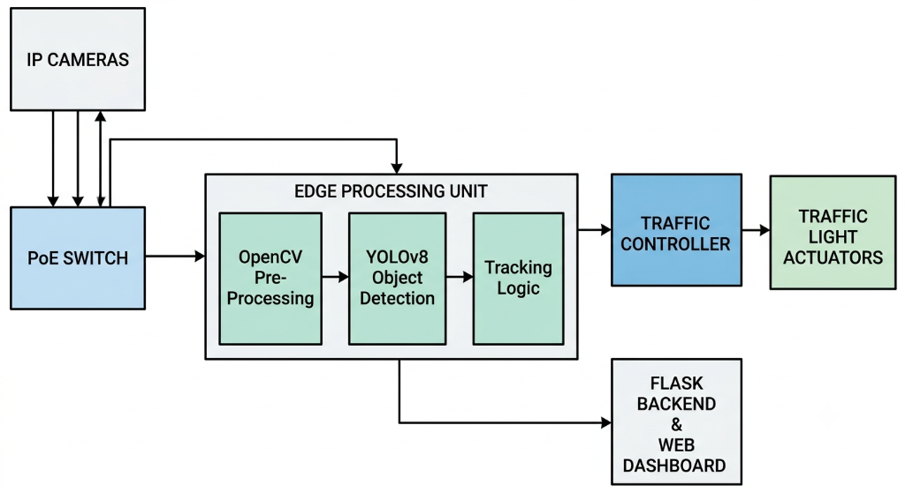
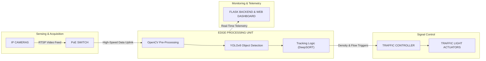

# Smart Traffic Management System 🚦📊

An AI-powered traffic monitoring and analytics system built using **YOLOv8**, **OpenCV**, and **Flask**. This project detects and classifies vehicles in real-time, calculates traffic density, and displays a live dashboard with actionable insights for smarter traffic control.

---

## 🔧 Features

- 🚗 Vehicle detection and classification (e.g., cars, trucks, buses, motorbikes)
- 📈 Real-time traffic density and vehicle count tracking
- 🎨 Color-coded visualizations per vehicle type
- 🧠 YOLOv8 integration for object detection
- 🌐 Flask web dashboard for monitoring
- 🔁 Video stream processing with DeepSORT object tracking
- ✅ Non-redundant counting logic to avoid double counts

---

## 📦 Technologies Used

- Python 3.x
- [Ultralytics YOLOv8](https://github.com/ultralytics/ultralytics)
- OpenCV
- Flask
- DeepSORT
- NumPy
- MySQL Connector

---

## 🏗️ Hardware Architecture

The Smart Traffic Management System leverages an intelligent edge-computing hardware architecture engineered for low-latency video analytics, real-time signal control, and remote monitoring.





### Architecture Components

1. **IP Cameras (Sensing Layer)**:
   - High-definition, weather-sealed IP cameras deployed across intersection approaches.
   - Stream real-time video feeds via RTSP/H.264/H.265 to capture dynamic traffic conditions.

2. **PoE (Power over Ethernet) Switch**:
   - IEEE 802.3at/af PoE network switch supplying both power and high-bandwidth Gigabit data connectivity to the camera array.
   - Simplifies physical deployment by minimizing external cabling and power drops.

3. **Edge Processing Unit (AI Compute Node)**:
   - On-premise industrial compute hardware (e.g., NVIDIA Jetson / industrial edge PC / server).
   - **OpenCV Pre-Processing**: Frame extraction, resizing, noise reduction, and region-of-interest (ROI) masking.
   - **YOLOv8 Object Detection**: High-throughput convolutional inference detecting cars, trucks, buses, and motorbikes.
   - **Tracking Logic (DeepSORT)**: Kalman filtering and deep appearance descriptor matching to track vehicles reliably across frames without double-counting.

4. **Traffic Controller & Traffic Light Actuators**:
   - Standard industrial traffic signal controller (NEMA TS2 / 170 / 2070 compatible) interfaced via GPIO/Serial/Modbus.
   - Dynamically modulates green light phase durations based on calculated directional vehicle density.
   - Controls physical traffic light heads and relay actuators.

5. **Flask Backend & Web Dashboard**:
   - Central telemetry and monitoring server.
   - Streams live annotated video to intersection control centers and authorized operators.
   - Offers real-time charts, vehicle count statistics, filterable logs, and CSV historical report generation.

---

## 🚀 Getting Started

### 1. Clone the Repository
```bash
git clone https://github.com/riturajkumar2002/Smart-Traffic-Management-System-.git
cd Smart-Traffic-Management-System-
```

### 2. Set Up a Virtual Environment (Optional but recommended)
```bash
python -m venv venv
# On Windows:
venv\Scripts\activate
# On Linux/macOS:
source venv/bin/activate
```

### 3. Install Dependencies
```bash
pip install -r requirements.txt
```

### 4. Run the Application
```bash
python traffic_detection.py
```
Then open your browser and navigate to `http://127.0.0.1:5000/`.

---

## 📂 Project Structure
```text
├── traffic_detection.py          # Main Flask & detection script
├── coco.names                    # COCO dataset class labels
├── datasets/                     # Dataset configurations
├── static/
│   ├── css, js, etc.             # Styling and frontend scripts
│   └── images/
│       ├── logo.png              # System logo
│       └── hardware_architecture.png # System hardware architecture diagram
├── templates/
│   └── index.html                # Flask dashboard UI
├── video/                        # Sample traffic video files
├── requirements.txt              # Python dependencies
├── yolov8n.pt                    # YOLOv8 nano pre-trained weights
└── README.md                     # Project documentation
```

---

## 🧠 Future Enhancements

- Live camera feed support (e.g., IP/RTSP)
- Historical traffic data logging and analytics
- Interactive charts (traffic patterns over time)
- Integration with traffic lights and automated signal control systems

---

## 👤 Author

**Rituraj Kumar**
- GitHub: [@riturajkumar2002](https://github.com/riturajkumar2002)
- Email: [riturajkumar9827@gmail.com](mailto:riturajkumar9827@gmail.com)

---

## 📘 License

This project is open-source and free to use under the MIT License.
